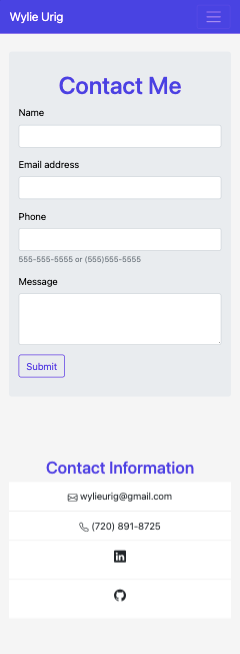
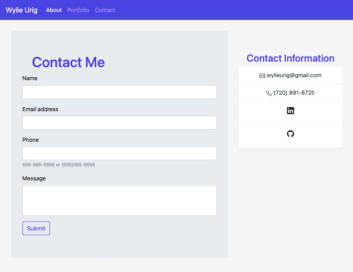
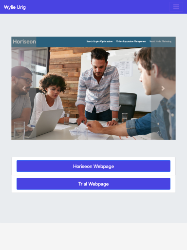
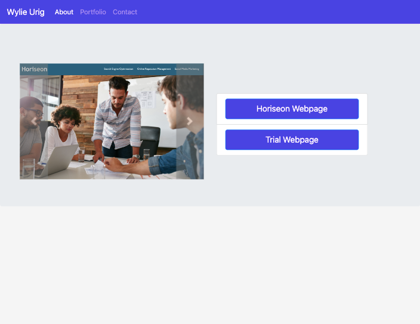

# About-Me-Portfolio Featuring Bootstrap
# Description

This project is my current working portfolio, which uses Bootstrap CSS Framework to achieve a mobile responsive layout. My portfolio includes an introduction into my life, displays my current project archive, and provides the reader with my contact information. 

The design layout includes features from Bootstrap's version 4.5, including the use of 'cards,' 'accordion's,' and the 'jumbotron' feature. This project also highlights the use of Bootstrap's Grid design, by incorporating the use of 'columns' and 'rows' into the HTML file. 

This was not an easy project, to say the least. I was challenged with properly using Bootstrap's Grid system, maintaining proper image quality for various layouts, and keeping my CSS organized and easy to read. 

I am definitely still new to this craft, but with every new challenge, I find myself enjoying the process even more. Hope you enjoy as well!

## Table of Contents
 * Installation 
 * Usage
 * Credits
 * License

## Installation

1. visit https://getbootstrap.com/ 

## Usage

## Credits
1. getbootstrap.com
2. https://www.w3schools.com

## License
...